# 💰 myWallet – Expense Tracker  

A modern and responsive **full-stack Expense Tracker** built using **React (Frontend)**, **Spring Boot (Backend)**, and **MySQL (Database)**.  
myWallet helps users manage income and expenses, track spending habits, and visualize data with charts.

---

## 🚀 Tech Stack  


---

## ✨ Features  

- ✅ **User Authentication** – Signup & Login (Role-based: Admin/User)  
- ✅ **Transactions** – Add, Edit, Delete income & expenses  
- ✅ **Categories** – Organize expenses (Food, Rent, Shopping, etc.)  
- ✅ **Dashboard** – View expense reports with interactive charts  
- ✅ **Admin Panel** – Manage users and categories  
- ✅ **Responsive UI** – Works on desktop, tablet, and mobile  

---

## 📸 Screenshots  

> 📌 Replace these placeholder images with real screenshots from your app.

### 🔑 Login Page  


<div align="center">


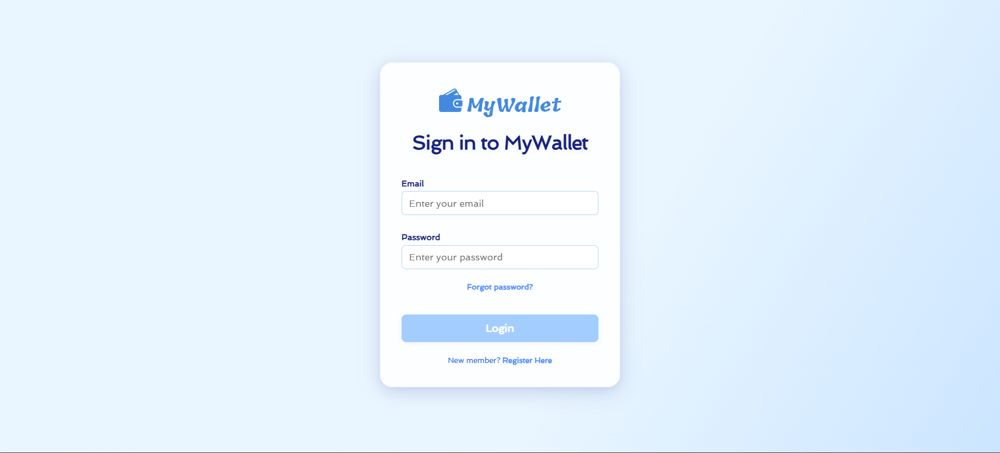
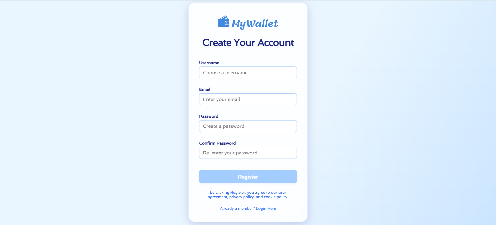
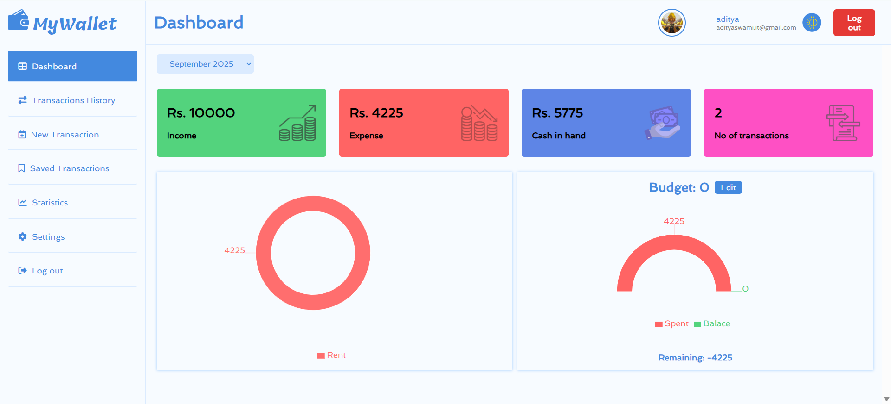
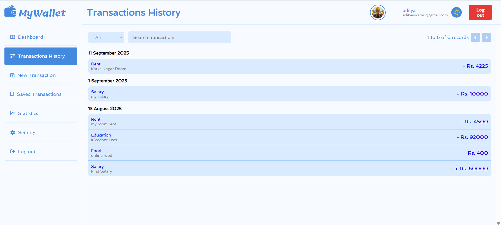
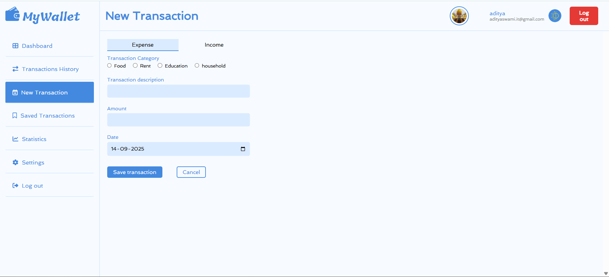
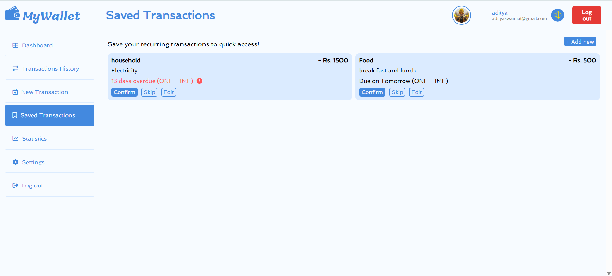
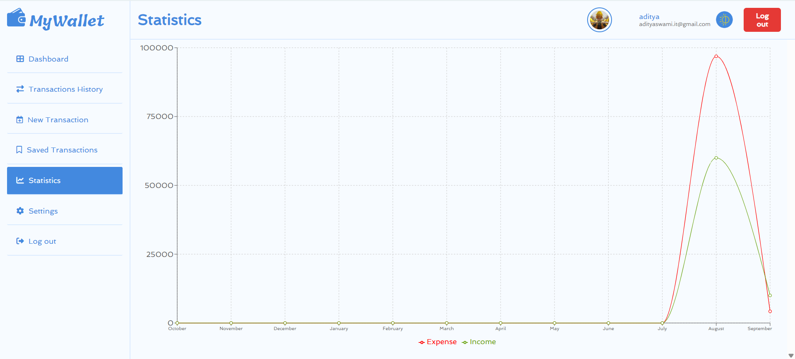
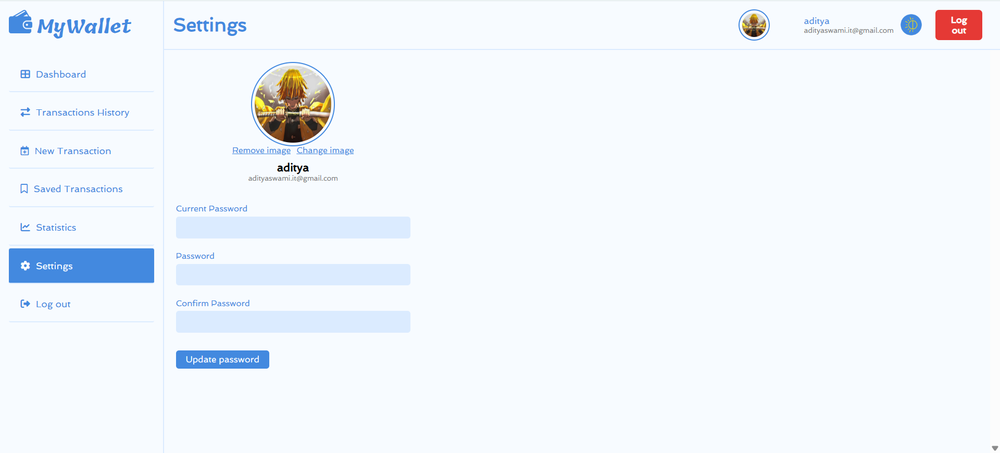
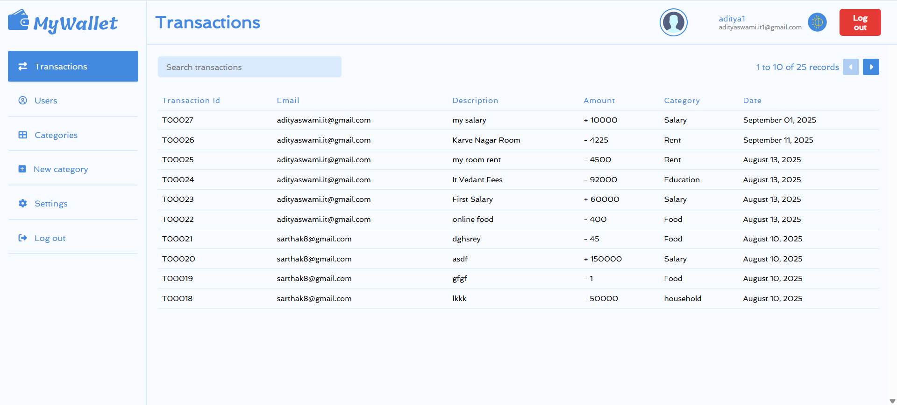
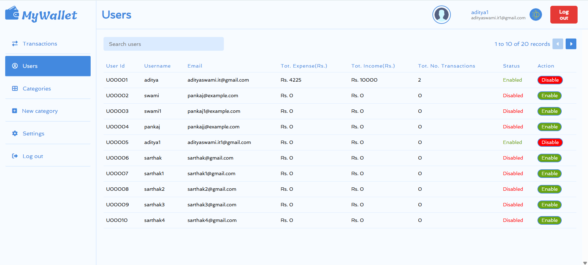
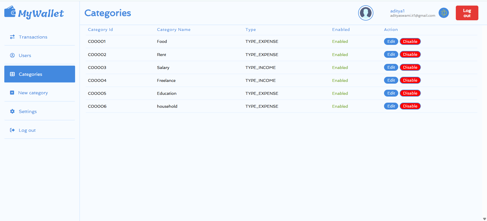
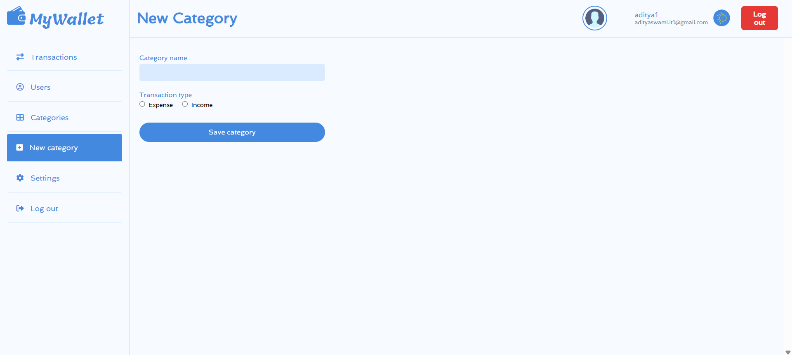

</div>

### 📊 Dashboard  


---

## ⚡ Getting Started  

### 1️⃣ Clone the repository  
```bash
git clone https://github.com/YOUR_USERNAME/expense-tracker-react-springboot.git
cd expense-tracker-react-springboot
```

### 2️⃣ Backend Setup  
```bash
cd backend
mvn spring-boot:run
```
Make sure MySQL is running and update `application.properties` with your database credentials.

### 3️⃣ Frontend Setup  
```bash
cd frontend
npm install
npm start
```
Open **http://localhost:3000** in your browser.

---

## 🛠️ API Endpoints  

| Method | Endpoint             | Description           |
|-------:|---------------------:|----------------------:|
| POST   | `/auth/signup`       | Register a new user   |
| POST   | `/auth/login`        | Login user            |
| GET    | `/transactions`      | Get all transactions  |
| POST   | `/transactions`      | Add a transaction     |

---

## 🤝 Contributing  

Pull requests are welcome! For major changes, open an issue first to discuss what you’d like to change.

---

## 📄 License  

This project is licensed under the **MIT License** – free to use and modify.

---

## 👨‍💻 Author  

**Aditya Swami**  
📧 [Email Me](adityaswami.it@gmail.com)  
🔗 [LinkedIn](https://www.linkedin.com/in/aditya-swami-67b8b7221/)  
🌐 [Portfolio Website](https://portfolioadityas.netlify.app)
